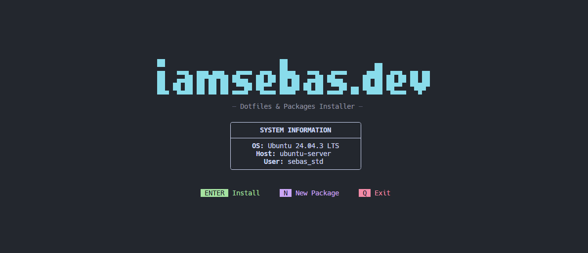

# 🚀 Dotfiles Manager TUI



An interactive and modern tool to manage your system configurations (dotfiles) with elegance, modularity, and a terminal-based visual interface (TUI). 🎨

## ✨ Interface

The manager is divided into intuitive screens designed so you don't have to edit configuration files manually:

### 1. 🏠 Welcome Screen

Your command center. From here, you can jump directly to installing your configured packages or enter the assistant to create new modules from scratch.

### 2. 📦 Package Selector

A menu organized by categories (System, Terminal, Editors, etc.).

* **Smart Selection**: The system automatically detects if a package requires another (dependencies) and marks it for you. 🧠
* **Customization**: By pressing `TAB`, you can access **Package Options** to change the package name, the manager (brew, cargo, system), or the target path.

### 3. 🧙 Creation Wizard

If you have a new configuration, the Wizard guides you step-by-step.

* **Real-time Validation**: Alerts you if the ID already exists or if data is missing. ⚠️
* **Preview**: See your module's Python code generated as you type.
* **Drafts**: Save your progress and resume later. 💾

### 4. ⚙️ Installer

Once your selection is confirmed, a detailed progress bar will keep you informed about exactly what is being installed and which files are being linked in your system.

---

## 🛠️ Installation and Usage

### Requirements

* **Python 3.10** or higher. 🐍

### Getting Started

1. **Clone the repository**:

    ```bash
    git clone https://github.com/iamseb4s/dotfiles.git
    cd dotfiles
    ```

2. **Launch the manager**:

    **🐧 Linux / 🍎 macOS**:

    ```bash
    ./install.sh
    ```

    **🪟 Windows**:
    > *Coming soon.* For now, using **WSL2** is recommended.

---

## ⌨️ Basic Controls

| Key | Action |
| :--- | :--- |
| `h / j / k / l` | Navigation (Vim-style) |
| `ENTER` | Confirm / Next |
| `TAB` | Open package options |
| `SPACE` | Select / Toggle |
| `Q` | Back / Quit |

---
*Based on the [Catppuccin Macchiato](https://github.com/catppuccin/catppuccin) color scheme.* 🐈
